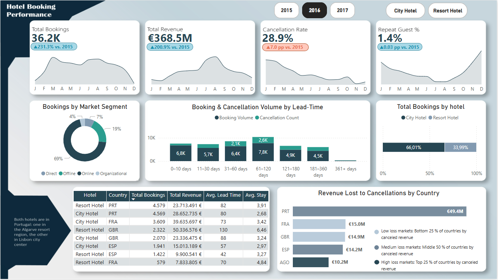

## Hotel Booking Analytics Dashboard

### Overview
This project delivers an interactive dashboard built in Power BI to analyze hotel bookings for two properties in Portugal: H1 (Resort Hotel in Algarve) and H2 (City Hotel in Lisbon). It provides KPIs, trend analyses, and detailed breakdowns to help stakeholders drive revenue, reduce cancellations, and optimize operations.
### Dataset
The underlying dataset contains 87,396 records of bookings with the following key fields:
  
- Hotel Type: City vs. Resort
- Country: Guest origin
- Arrival Date: Year, month, day components
- adr: Average daily rate
- stays_in_week_nights & stays_in_weekend_nights: Nights stayed
- lead_time: Days between booking entry and arrival
- is_canceled: 1 = canceled, 0 = completed
- is_repeated_guest: 1 = repeat guest, 0 = new
- customer_type, meal, market_segment, distribution_channel

### Key Analytical Questions

1. Booking & Revenue Performance
    - Which property (H1 vs. H2) drives more bookings and revenue year‑over‑year?
    - What is the YoY percentage change in Total Revenue and Cancellation Rate for the selected year?

2. Cancellation Risk
    - How does cancellation rate vary by country, hotel type, and lead‑time bucket?
    - Which countries lose the most revenue to cancellations (absolute and percentage‑point terms)?

3. Guest Behavior
    - What lead‑time segments account for the highest booking volume and cancellation counts?
    - How does average stay duration differ between city and resort guests across top markets?

4. Market Segmentation
    - Which market segments, distribution channels, and customer types contribute most to revenue and profitability?

